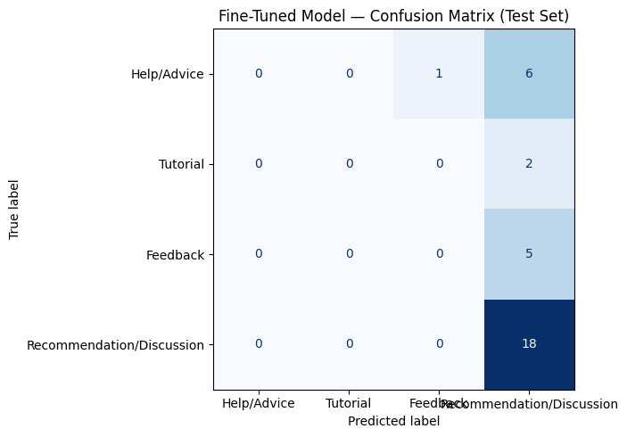

# ai201-project3-takemeter

## Demo

Watch the demo (live classification + evaluation walkthrough): [Demo video on Loom](https://www.loom.com/share/1c79e258bdb3491eb20afd4454f79ebc)

## **Community choice and reasoning**

- **Context:** r/FL Studio community forum posts about usage, recommendations, and troubleshooting.
- **Why chosen:** I have some interest in Fl Studio but have never used it, so to learn more about the software and potentially help others with similar interests. The forum provides high real-world usefulness for intent classification, varied language, and clear downstream use-cases (recommendation filtering, help routing) within the subreddit already.

## **Label taxonomy: definitions and 2 examples per label**

The four labels used in this project (copied from the annotation spec) are:

- **Help/Advice:** The author asking for assistance with a specific technical problem, troubleshooting issue, or difficulty involving FL Studio, plugins, or project files.
  - Example 1: "My project crashes when I load Serum; FL Studio freezes at 30% CPU—any ideas how to fix the buffer or plugin settings?"
  - Example 2: "I've lost the mixer routing in my .flp after moving samples—how can I relink files without breaking automation?"

- **Tutorial:** The author is teaching or explaining a process for producing a specific sound, effect, technique, or workflow in FL Studio, rather than asking the community to solve a personal problem.
  - Example 1: "Step-by-step: how I sidechain a bass to a kick in FL Studio using Fruity Limiter for a punchy mix."
  - Example 2: "Quick guide: creating a 2-step drum roll using the piano roll and pattern clips for live performance."

- **Feedback:** The author shares their own music, mix, project, or loop and explicitly seeks feedback, critique, evaluation, or reactions from the community.
  - Example 1: "Here’s a 30-second mix I made—looking for feedback on low-end clarity and arrangement."
  - Example 2: "Sharing my latest beat made with only stock FL plugins; open to critique and improvement tips."

- **Recommendation/Discussion:** The author asks for or provides recommendations about plugins, presets, samples, instruments, or production tools OR initiates a broader discussion/opinion about music-production choices that is not primarily a request for technical troubleshooting, a tutorial, or feedback on their own work.
  - Example 1: "What's the best free reverb plugin for pads? Looking for something lightweight for laptop use."
  - Example 2: "Do people prefer template workflows or start-from-scratch for film scoring? Pros and cons?"

## **Data collection source, labeling process, label distribution, and difficult examples**

- **Source:** Raw posts and comments were collected from the subbreddit forum r/FL_Studio and exported into [fl_studio_dataset.csv](fl_studio_dataset.csv).

- **Labeling process:** Based on the comments and posts exported into [fl_studio_dataset.csv], I used the GPT-5 mini to perform pre-labeling based on my labels and definitions in [planning.md]. After the LLM completed the pre-labeling, I went back through the dataset to see what the LLM did, manually labeled every post and comment, and noted the ambiguous cases if there were any.

- **Label distribution:** 
Columns: ['text', 'label', 'notes']
Total examples: 210

| Label | Count | Percentage |
------------------------------
| Recommendation/Discussion | 119 | 56.67% |
| Help/Advice | 43 | 20.48% |
| Feedback| 31 | 14.76% |
| Tutorial | 17 | 8.1% |

- **Three difficult-to-label examples:**
  
1. Example (sample cloning / file-size):

  - Excerpt: "How to make many versions of same sample without ballooning file space? ... I'm new to FL Studio and I don't know a lot about it"
  - CSV label: `Help/Advice`
  - Notes: "Ambiguous between Help/Advice and Tutorial. Applied primary-rule: Help/Advice."
  - Final decision & reasoning: **Help/Advice** — the author asks for a specific fix/workflow solution for a project problem (how to isolate/clones), so it's treated as troubleshooting rather than a general how‑to tutorial.

2. Example (seeking collaborator):

  - Excerpt: "Looking for guitarist ... I would love to connect with someone who is passionate about creating music and happy to lend a helping hand..."
  - CSV label: `Recommendation/Discussion`
  - Notes: "Ambiguous between Help/Advice and Recommendation. Applied primary-rule: Help/Advice. | Relabeled Help/Advice -> Recommendation/Discussion (new definitions): seeking a collaborator, not technical help."
  - Final decision & reasoning: **Recommendation/Discussion** — interpreted as a collaborator-seeking / community-discussion post (not a technical troubleshooting request), so it fits the Recommendation/Discussion label.

3. Example (soundfont / memory crash):

  - Excerpt: "Then I just saved all the individual files in a separate folder.. and repeated for all my sound fonts... :D"
  - CSV label: `Help/Advice`
  - Notes: "Ambiguous between Help/Advice and Tutorial. Applied primary-rule: Tutorial. | Relabeled Tutorial -> Help/Advice (new definitions): post is a troubleshooting request; edit describes how author solved it."
  - Final decision & reasoning: **Help/Advice** — the thread centers on fixing a crash/behavior (memory/installation problem); although the author's resolution reads like a mini-tutorial, the core intent is troubleshooting.
  
  
## **Fine-tuning approach: base model, training setup, and hyperparameter decisions**

- **Base model:** DistilBERT (`distilbert-base-uncased`), a small, fast encoder model, fine-tuned with a 4-class classification head (one output per label). Labels were mapped to class IDs as follows:

  | Label | Class ID |
  |---|---:|
  | Help/Advice | 0 |
  | Tutorial | 1 |
  | Feedback | 2 |
  | Recommendation/Discussion | 3 |

- **Training setup:**

  | Setting | Value |
  |---|---|
  | Train / validation / test split | 147 / 31 / 32 examples (70% / 15% / 15%) |
  | Epochs | 3 (10 steps per epoch, 30 steps total) |
  | Batch size | 16 (train) / 32 (eval) |
  | Learning rate | 2e-5 |
  | Warmup steps | 50 |
  | Weight decay | 0.01 |
  | Optimizer | AdamW (Hugging Face `Trainer` default) |
  | Evaluation / checkpointing | Every epoch; best checkpoint by validation accuracy kept (`load_best_model_at_end=True`) |
  | Class weighting | None |
  | Augmentation | None |

  Label distribution by split:

  | Label | Train | Test |
  |---|---:|---:|
  | Recommendation/Discussion | 83 (56.5%) | 18 (56.3%) |
  | Help/Advice | 30 (20.4%) | 7 (21.9%) |
  | Feedback | 22 (15.0%) | 5 (15.6%) |
  | Tutorial | 12 (8.2%) | 2 (6.3%) |

  Training log:

  | Epoch | Training loss | Validation loss | Validation accuracy |
  |---:|---:|---:|---:|
  | 1 | 1.353 | 1.339 | 0.613 |
  | 2 | 1.315 | 1.297 | 0.581 |
  | 3 | 1.252 | 1.230 | 0.581 |

- **Key hyperparameter decision:** I used a learning rate of 2e-5 with 50 warmup steps, standard defaults for fine-tuning BERT-style models. With only 147 training examples and a batch size of 16, though, each epoch is just 10 steps, so the whole run was 30 steps. Warmup increases the learning rate gradually over the first 50 steps, so training ended before the learning rate ever reached 2e-5 (it peaked at about 1.2e-5). Combined with only 3 epochs, the model barely trained. With four classes, a model that guesses evenly has a loss of about 1.39 (ln 4), and my training loss only fell from 1.35 to 1.25, with validation loss still dropping at epoch 3. A second setting made this worse: `load_best_model_at_end` picked the checkpoint with the highest validation accuracy, which was epoch 1 (0.613), the *least* trained checkpoint. The validation set has 18 `Recommendation/Discussion` posts out of 31, so always predicting that label scores 0.581: epochs 2 and 3 scored exactly that, and epoch 1 was only one post better. On the test set, the selected model predicted `Recommendation/Discussion` for 31 of 32 posts. In hindsight, I would scale warmup to the dataset size (e.g., 10% of total steps), train for more epochs, select checkpoints by validation loss or macro F1 instead of accuracy, and add class weighting so the model is penalized more for missing the smaller classes (only 12 `Tutorial` training examples vs. 83 `Recommendation/Discussion`).

## **Baseline description: prompt used and result collection**

- **Baseline method:** Zero-shot baseline (Groq)

- **Prompt:** 

SYSTEM_PROMPT = """
You are classifying posts from the r/FL_Studio community.
Assign each post to exactly one of the following categories.

Help/Advice: The author asking for assistance with a specific technical problem, troubleshooting issue, or difficulty involving for FL Studio, plugins, or project files.
Example: "My project crashes when I load Serum; FL Studio freezes at 30% CPU—any ideas how to fix the buffer or plugin settings?"

Tutorial: The author is teaching or explaining a process for producing a specific sound, effect, technique, or workflow in FL Studio, rather than asking the community to solve a personal problem.
Example: "Step-by-step: how I sidechain a bass to a kick in FL Studio using Fruity Limiter for a punchy mix."

Feedback: The author shares their own music, mix, project, or loop and explicitly seeks feedback, critique, evaluation, or reactions from the community.
Example: "Here’s a 30-second mix I made—looking for feedback on low-end clarity and arrangement."

Recommendation/Discussion: The author asks for or provides recommendations about plugins, presets, samples, instruments, or production tools OR initiates a broader discussion/opinion about music-production choices that is not primarily a request for technical troubleshooting, a tutorial, or feedback on their own work.
Example: "What's the best free reverb plugin for pads? Looking for something lightweight for laptop use."

When a post could fit more than one category, choose the category that best represents the post's primary intent.

Respond with ONLY the label name.
Do not explain your reasoning.

Valid labels:
Help/Advice
Tutorial
Feedback
Recommendation/Discussion
"""

- **Result collection:** how predictions and confidences were recorded and aggregated.

## **Full evaluation report**

- **Metrics reported:** overall accuracy, per-class precision, recall, F1, and support for both models on the same 32-example test set.

**Overall accuracy**

Test set size: 32 examples.

| Model | Accuracy |
|---|---:|
| Zero-shot baseline (Groq) | 0.8438 (27/32; all 32 responses parseable) |
| Fine-tuned DistilBERT (`distilbert-base-uncased`) | 0.5625 (18/32) |
| **Difference (fine-tuned − baseline)** | **−0.2812** |

**Per-class metrics — zero-shot baseline (Groq)**

| Label | Precision | Recall | F1 | Support |
|---|---:|---:|---:|---:|
| Help/Advice | 0.78 | 1.00 | 0.88 | 7 |
| Tutorial | 0.00 | 0.00 | 0.00 | 2 |
| Feedback | 0.83 | 1.00 | 0.91 | 5 |
| Recommendation/Discussion | 0.88 | 0.83 | 0.86 | 18 |
| **Macro avg** | 0.62 | 0.71 | 0.66 | 32 |
| **Weighted avg** | 0.80 | 0.84 | 0.82 | 32 |

**Per-class metrics — fine-tuned DistilBERT**

| Label | Precision | Recall | F1 | Support |
|---|---:|---:|---:|---:|
| Help/Advice | 0.00 | 0.00 | 0.00 | 7 |
| Tutorial | 0.00 | 0.00 | 0.00 | 2 |
| Feedback | 0.00 | 0.00 | 0.00 | 5 |
| Recommendation/Discussion | 0.58 | 1.00 | 0.73 | 18 |
| **Macro avg** | 0.15 | 0.25 | 0.18 | 32 |
| **Weighted avg** | 0.33 | 0.56 | 0.41 | 32 |

The zero-shot baseline outperformed the fine-tuned model by 28.1 percentage points. The fine-tuned model's 0.562 accuracy is exactly what you get by always predicting the majority class (18 of 32 test posts are `Recommendation/Discussion`): it predicted that label for 31 of 32 posts and never correctly identified a `Help/Advice`, `Tutorial`, or `Feedback` post, which is why its macro F1 is only 0.18. The baseline handled `Help/Advice` and `Feedback` well (F1 0.88 and 0.91), but both models scored 0.00 on `Tutorial`, the smallest class with only 2 test examples.

- **Confusion matrix:** fine-tuned model on the test set (32 examples). Rows are true labels; columns are predicted labels.

| True \\ Pred | Help/Advice | Tutorial | Feedback | Recommendation/Discussion |
|---|---:|---:|---:|---:|
| **Help/Advice** | 0 | 0 | 1 | 6 |
| **Tutorial** | 0 | 0 | 0 | 2 |
| **Feedback** | 0 | 0 | 0 | 5 |
| **Recommendation/Discussion** | 0 | 0 | 0 | 18 |

- **Three specific wrong predictions with analysis:**

  1. **Workflow description**
     - **Example:** "Everyone does things differently, but my workflow tends to be the following: * Make a melody that sounds catchy to me * Build chords that I can loop * Lay out the structure for percussion..."
     - **True label:** `Tutorial` | **Predicted:** `Recommendation/Discussion` (confidence: 0.28)
     - **Why the model got it wrong:** The text has no title and opens with "Everyone does things differently," which reads like a reply in an opinion thread, the most common style in `Recommendation/Discussion`. `Tutorial` is also the smallest class (17 examples, 8.1%), so the model has seen very few instructional posts, and almost none written casually like this one.
     - **What could improve it:** Add more `Tutorial` examples (especially informal, comment-style ones), use class weighting during training so the small classes are not ignored, and separate comments from posts so a missing title isn't a misleading signal.

  2. **Early work-in-progress track**
     - **Example:** "Halloween is only . . . a month and a half away. I'm not crazy, I SWEAR. VERY early in the works, so I'm not concerned about things like song structure. Does the sound design work for a 'deepest pi...'"
     - **True label:** `Feedback` | **Predicted:** `Recommendation/Discussion` (confidence: 0.28)
     - **Why the model got it wrong:** The author is sharing their own track and asking how it sounds, but the track itself is audio the model never sees. What remains is a short, joking text with an open question ("Does the sound design work...?"), and open questions are also typical of `Recommendation/Discussion` posts. Many `Feedback` errors followed this pattern: short text, an attached link or media file, and "thoughts?"-style wording.
     - **What could improve it:** Add features that mark self-shared work (e.g., a flag for links or attached media, and phrases like "my track," "first song," "just finished," "WIP"), and add more `Feedback` examples where most of the content is in the attachment rather than the text.

  3. **Audio-quality question**
     - **Example:** "Does Changing The Tempo Of Audio File Lower Quality In FL Studio? I change the tempo of audio files (such as samples or even entire song masters, if I am doing a mashup or DJ set, etc) in FL Studio a..."
     - **True label:** `Help/Advice` | **Predicted:** `Recommendation/Discussion` (confidence: 0.29)
     - **Why the model got it wrong:** This is a technical question about how FL Studio behaves, but it has no problem words like "error," "crash," or "help," so it looks like a general discussion question. The bigger issue is that the model hardly separates the classes at all: 13 of the 14 wrong predictions were `Recommendation/Discussion`, all with confidence around 0.28–0.30, only slightly above the 0.25 expected from random guessing across four labels. Because `Recommendation/Discussion` makes up 56.67% of the dataset, the model falls back on it whenever it is unsure. It even missed posts that contain "help" outright (e.g., "Pls help me install everything for FL studio").
     - **What could improve it:** Fix the class imbalance first (class weights, oversampling the smaller classes, or collecting more `Help/Advice`, `Feedback`, and `Tutorial` posts), then check that training actually converges (more epochs or a different learning rate). Once the model is learning, add `Help/Advice` examples that are phrased as conceptual "how does X work" questions rather than error reports.

- **Sample-classifications table:** 

| Post (truncated) | True label | Predicted | Confidence | Correct? |
|---|---|---|---|---|
| PitchNet: a free, open-source vocal tuner that complements NewTone  I’m developing PitchNe... | Recommendation/Discussion | Recommendation/Discussion | 0.27 | yes |
| I always just cut it on the beat the tempo changes and then it's usually fine. (I also usu... | Recommendation/Discussion | Recommendation/Discussion | 0.28 | yes |
| finding clearable samples is soo hard but every now and then you find a good one | Recommendation/Discussion | Recommendation/Discussion | 0.29 | yes |
| How to make many versions of same sample without ballooning file space?  When I tried taki... | Help/Advice | Recommendation/Discussion | 0.29 | no |
| Help!! Need assistance with presets on my controller (Mpd26)  Video explains it all. I’m u... | Help/Advice | Recommendation/Discussion | 0.29 | no |

The first prediction (PitchNet) is reasonable because the author is introducing a free, open-source vocal tuning plugin to the community, which fits the `Recommendation/Discussion` definition of providing recommendations about production tools rather than asking for help, teaching a technique, or sharing their own music for feedback.

## **Reflection: what the model learned vs. what you intended**

- **What I intended:** A classifier that reads an r/FL_Studio post and recognizes the author's intent (asking for help, teaching a technique, sharing work for feedback, or discussing tools and opinions), so posts could be routed or filtered by intent. My spec set "good enough" as macro F1 ≥ 0.70 and clearly better than a majority-class baseline.
- **What the model actually learned:** The fine-tuned DistilBERT model learned the label frequencies, not the intents. It predicted `Recommendation/Discussion` for 31 of 32 test posts, with confidence around 0.28–0.30 (barely above the 0.25 of an even guess). Its 0.562 accuracy equals the majority-class baseline, and its macro F1 is 0.18. It ignored even obvious cues: posts containing "help," "Pls help," or a question title were still labeled `Recommendation/Discussion`.
- **Systematic errors and biases:**
  - **Majority-class bias:** every minority class (`Help/Advice`, `Tutorial`, `Feedback`) had 0.00 recall. This comes from both the imbalanced data (56% `Recommendation/Discussion`) and undertraining (30 steps, with warmup never finishing).
  - **Text-only blind spot:** many `Feedback` posts are a short line plus a link or audio file. The actual content is in the attachment, which neither model can see.
  - **`Tutorial` is unlearned by both models:** even the zero-shot baseline scored 0.00 F1 on it. With only 12 training and 2 test examples, and casual comment-style tutorials that read like opinions, this label is not reliably learnable from my current data.
- **Comparison with the baseline:** the zero-shot Groq baseline came much closer to what I intended (0.844 accuracy, 0.66 macro F1, with strong `Help/Advice` and `Feedback` scores). However, it also fell short of my 0.70 macro F1 target, mainly because of `Tutorial`.

## **Spec reflection**

- **One way the spec helped:** The spec's choice of **macro F1 as the primary metric**, made because "accuracy alone hides class imbalance," is what revealed the model's failure. Validation accuracy during training (0.58–0.61) and test accuracy (0.562) looked passable on their own, but macro F1 (0.18) and per-class recall (0.00 for three of four labels) showed the model had collapsed onto one label. 

- **One way implementation diverged:**  I collected 210 examples by randomly sampling posts and comments from r/FL_Studio (via [collect_fl_studio.py](collect_fl_studio.py)). Because the sample was random, the dataset kept the subreddit's natural imbalance: 119 `Recommendation/Discussion` examples but only 17 `Tutorial`. With so few examples overall, that imbalance left the minority classes with very little training data (12 `Tutorial` training examples), which is a main reason the fine-tuned model collapsed onto `Recommendation/Discussion`. In hindsight, I should of utilized my underrepresentation handling steps more effectively after completing my first round of labelling and running. Instead, I chose to re-label, tighten my definitions, and finally, target specific posts/comments that fit within my label for `Tutorial` only.

## **AI usage**

- **Instance 1 — Pre-labeling the dataset (annotation assistance):**
  - **What I directed:** I gave GPT-5 mini my four label definitions and edge-case rules from [planning.md](planning.md) and asked it to assign one label to each post and comment in [fl_studio_dataset.csv](fl_studio_dataset.csv).
  - **What it produced:** A first-pass label for every example.
  - **What I changed or overrode:** I treated its output as a draft only. I went back through the entire dataset, manually labeled every post and comment myself, and recorded ambiguous cases in the `notes` column. All final labels are mine.

- **Instance 2 — Error analysis of wrong predictions:**
  - **What I directed:** I gave Claude (in Claude Code) the 14 wrong predictions from the fine-tuned model's test set and asked it to identify surface patterns in the errors, without changing any files.
  - **What it produced:** An analysis showing that 13 of the 14 errors were predicted as `Recommendation/Discussion` with confidence of about 0.28–0.30 (close to random guessing across four labels), along with secondary patterns: missed "help"/question wording, `Feedback` posts that depend on attached audio or links, comment-style `Tutorial` posts with no title, and one non-English post.
  - **What I changed or overrode:** Claude suggested that the two `Tutorial` errors might be labeling noise rather than model mistakes; I kept my original `Tutorial` labels and treated them as model errors in the analysis.

- **Instance 3 — Data collection and cleanup scripts:**
  - **What I directed:** I had an AI tool write helper scripts to build and clean the dataset:
    - [collect_fl_studio.py](collect_fl_studio.py): combine the exported r/FL_Studio post and comment JSON files, drop `[deleted]`/`[removed]` text, and sample 100 posts and 100 comments into [fl_studio_dataset.csv](fl_studio_dataset.csv).
    - [fix_csv_better.py](fix_csv_better.py): repair malformed CSV rows by locating the label column and writing a cleaned copy.
    - [scripts/fix_labels.py](scripts/fix_labels.py): fix the misspelled label `Recommedation/Discussion`, with a timestamped backup.
    - [scripts/update_recommendation_label.py](scripts/update_recommendation_label.py): rename every `Recommendation` label to `Recommendation/Discussion`, with a backup.
  - **What it produced:** Working scripts that created the dataset and fixed its formatting and label-name problems.
  - **What I changed or overrode:** I chose the data source, the 100/100 split between posts and comments, and the final label names. I ran each script and checked the resulting CSV before using it. The scripts only changed formatting and label spelling; they did not decide which label any example received.

---

